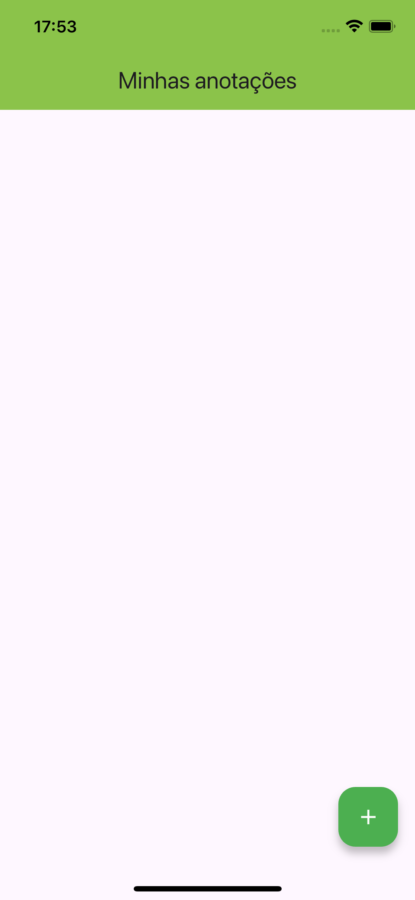
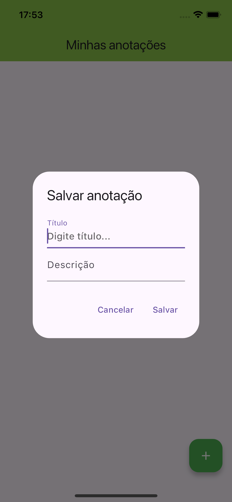
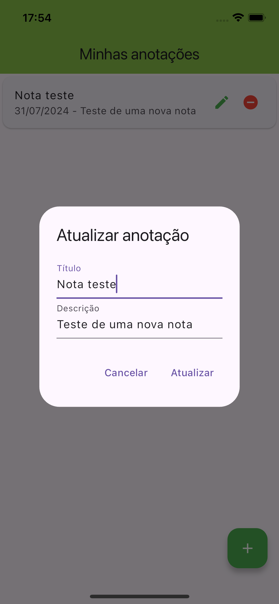
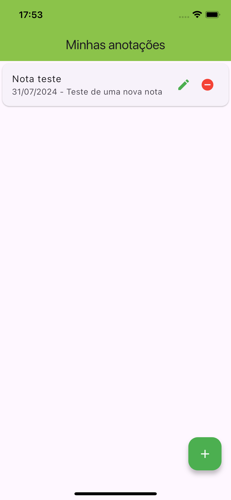

# App Notas Diárias

## Descrição

Um aplicativo desenvolvido durante o curso de Desenvolvimento Flutter Mobile, com o objetivo de entender e aplicar conceitos fundamentais na criação de um aplicativo de notas diárias, salvando as informações no armazenamento do dispositivo com o sqflite.

## Curso

**Desenvolvimento Android e IOS com Flutter - Crie 15 Apps**

[Link para o curso na Udemy](https://www.udemy.com/course/desenvolvimento-android-e-ios-com-flutter/?couponCode=MCLARENT71824)

## Status do Projeto

- **Concluído:** 12/10/2021
- **Atualizado:** 30/07/2024

## Tecnologias Utilizadas


## Funcionalidades

- Listagem das notas
- Criar uma nova nota
- Atualizar uma nota
- Apagar uma nota

## Instalação

Siga os passos abaixo para rodar o projeto localmente:

1. Clone o repositório:
    ```sh
    git clone https://github.com/rafaelleonan/app-flutter-notas-diarias.git
    ```
2. Navegue até o diretório do projeto:
    ```sh
    cd app-flutter-notas-diarias
    ```
3. Instale as dependências:
    ```sh
    flutter pub get
    ```
4. Configure o Firebase para o seu projeto:
    - Siga as instruções no [Firebase Console](https://console.firebase.google.com/)
    - Adicione os arquivos de configuração `google-services.json` (Android) e `GoogleService-Info.plist` (iOS)

5. Execute o aplicativo:
    ```sh
    flutter run
    ```

## Telas
<p>
  
  
  
  
</p>

## Video Demonstração
[Assista o vídeo](https://ucb4b28a2668ad9dc8fed51e3729.dl.dropboxusercontent.com/cd/0/inline/CXxXgQ3kvlECI5weM4hwf2GNXKXlsg4POlEPUeJySgyjSG36o8r20_p8wPJNmap5dXIJXFxkyzx0oi4mgYgyjSAk3RtjFnh94ByZXi6DB1RzjHE6AA273JKCcQeS2xa1k9e7bQamMbNc3ufK5EPlNpc5/file#)